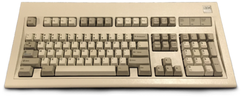
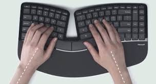
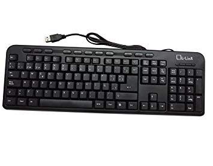
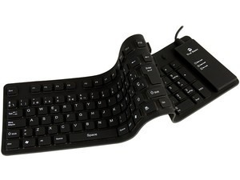
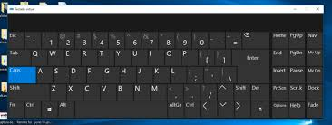
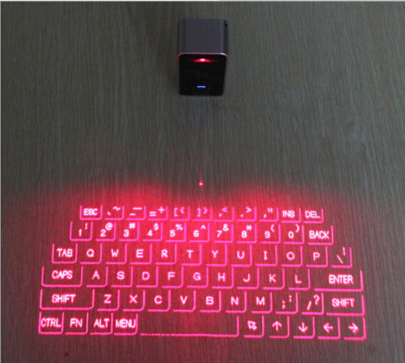
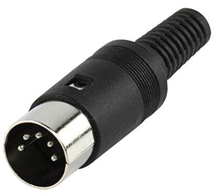
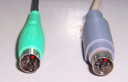

# **_Teclados_**

El teclado es un periférico de entrada compusto de teclas que envían información a la computadora.
 
 ## Teclado estandar.

 

El teclado estandar  fue desarrollado por IBM en 1987 y está dividido en 4 bloques.
1. **Bloque de funciones**: comprende las teclas desde F1 a F12 divididas en 3 grupos de 4 (F1-F4 F5-F8 F9-F12). A la izquierda de este bloquye se situa la tecla Esc.
2. **Bloque alfanumérico**: está por debajo del bloque de funciones, contiene los números del 0 al 9 (situando al 0 en última posición) y el alfabeto organizado como en una máquina de escribir. Además contiene algunas teclas especiales como Tab, alt o Ctrl.
3. **Bloque especial**: está ubicado a la derecha del bloque alfanumérico y contiene teclas especiales, entre ellas Pausa, Insert, Inicio, Supr, además de las flechas direccionales.
4. **Bloque numérico**: Situado a la derecha del bloque especial y contiene los números arábigos organizados como en una calculadora. Además contiene el punto de separador decimal y teclas para las operaciones básicas.

## Tipos de teclados:
* _Según su forma física_:
    * **Teclado ergonómico**: Diseñados para una mayor comodidad, ayuda a tener una posición más relajada.      
      
    * **Teclado multimedia**: Añaden teclas especiales para orientadas a algunos programas como el correo electrónico, la calculadora o reproductores multimedia.   
      
    * **Teclado flexible**: Teclados de plástico o silicona que pueden ser doblados e incluso adaptarse a superficies irregulares. Pueden ser conectados a dispositivos portátiles y teléfonos inteligentes.    
         
          
    * **Teclado en pantalla**: También llamados teclados virtuales, se utilizan mayoritariamente en dispositivos móviles.
         
         
    * **Teclado de proyección**: Similares a un teclado estandar pero con laser.
    
        
* _Según la tecnología de sus teclas_:
    * **Teclados de cúpula de goma**.
    * **Teclados de membrana**.
    * **Teclados capacitivos**.
    * **Teclados de contacto metálico**.
    * **Teclados mecánicos**.
* _Según el puerto de conexión_.
    * **Teclado con conector paralelo**: Obsoleto.
    * **Telado con conector DIN o PS/2**: El conector DIN fue usado por pocos ordenadores y se remplazó rapidamente debido principalmente a su tamaño. El PS/2, también llamado mini DIN es similar pero de un tamaño reducido. Aún es utilizado hoy en dia pero ya está siendo sustituido por el conector USB. 
     
    * **Teclado con conector USB**: Se comenzó a ver tras la estandarización del USB pero no era muy usado hasta la salida del iMac, el cual traía de serie tanto teclado como ratón con conexión USB.
    * **Teclado inalámbrico**: Son teclados en los que la comunicación entre el teclado y el ordenador se efectua mediante infrarrojos, ondas de radio o Bluetooth.
    

       

  
